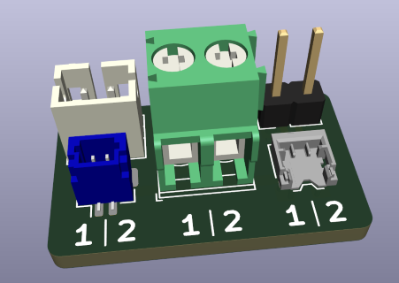
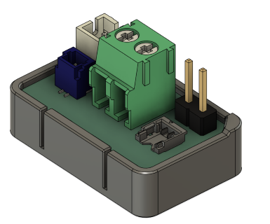

# Battery Breakout PCB

This is a small PCB for connecting various types of 2-pin LiPo batteries. It has connectors for Molex Pico EZ-mate, JST SH, and JST PH plugs as well as a terminal for bare wire batteries. It also has a 2-pin header for connecting to a device.

Because there is no standard polarity for these batteries, the pins are not labeled as positive and negative. Instead, the pins on the left side of each connector are labeled 1 and are connected together, and the pins on the right side of each connector are labeled 2 and are connected together. You should check the polarity of the battery before connecting the breakout to your device. For example, if the positive wire of the battery is on the 1 (left) side of the connector, you should connect the positive side of your device to the 1 (left) side of the 2-pin header.

## Bill of Materials

You will need one of each of the following parts:

- 2-pin header, 2.54 mm pitch
- 2-pin terminal block, 3.5 mm pitch
  - e.g. Phoenix Contact 1935161
- JST B2B-PH-K-S
- JST BM02B-SRSS-TB
- Molex 0781710002

## Enclosure

A 3D-printable enclosure is also provided in [STEP](enclosure/battery-breakout-enclosure.step) and [3MF](enclosure/battery-breakout-enclosure.3mf) formats. This covers the bottom of the PCB to prevent the through hole components from shorting out on anything.

